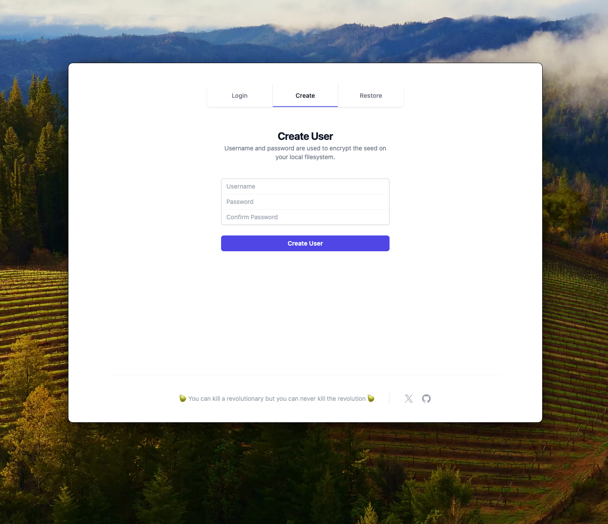
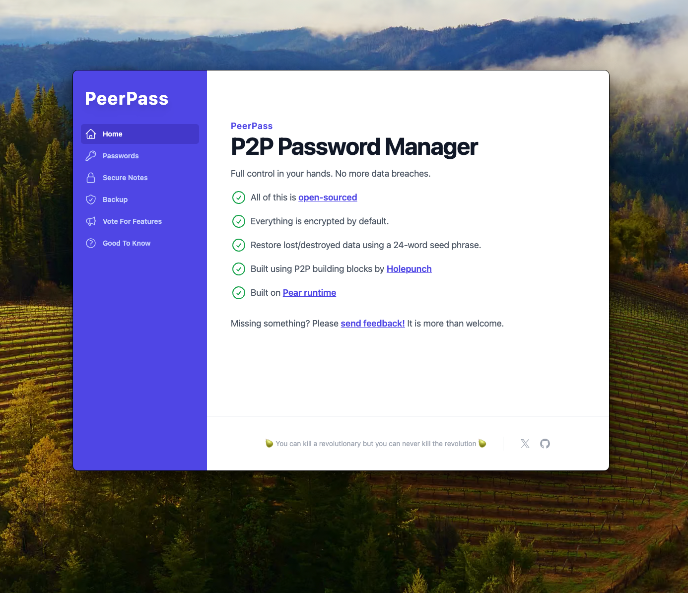
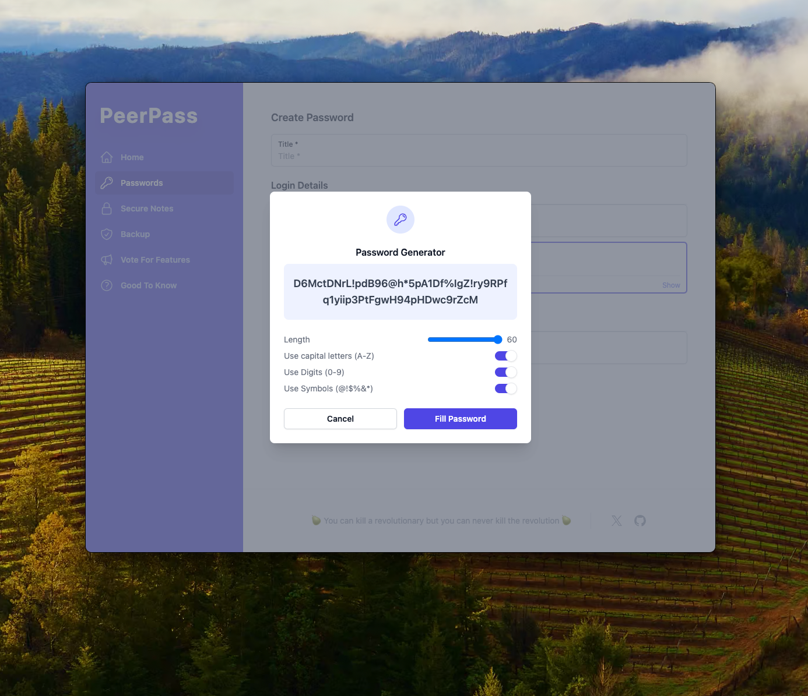

# PeerPass

PeerPass – your digital life manager. Pure P2P, everything is encrypted by default. Full control in your hands, no more data breaches.

Built using P2P building blocks by [Holepunch](https://docs.pears.com/) - Developed and deployed on [Pear runtime](https://docs.pears.com/)

> Frontend and backend are separated into their own repositories; this is the frontend repository. [You can find the backend from here.](https://github.com/MKPLKN/peer-pass-backend)

<p align="center">
  
  
  
</p>

## Features

- Create/Restore/Login users
- CRUD operations for Passwords
- Quick actions to use passwords
- Easy data backup and restore
- In-app voting for features and feedback
- **_WIP_:** CRUD operations for Secure Notes
- **_WIP_:** Share info P2P

## Development

If you do not have pears installed, [get started here.](https://docs.pears.com/guides/getting-started)

```sh
git clone <repo_url>

npm install

// Compiles CSS file into ./dist/output.css – the project uses the Tailwind CSS
npm run css

// Compiles JSX into JS file(s) into ./dist
npm run build

// Start development
pear dev
```
